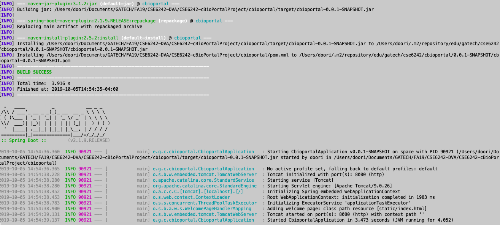
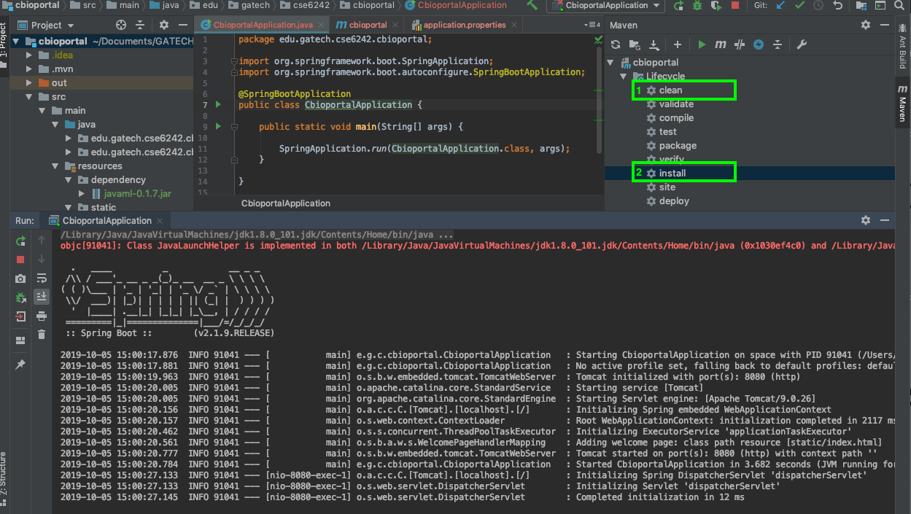
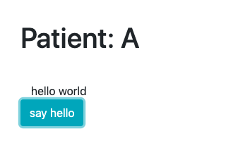
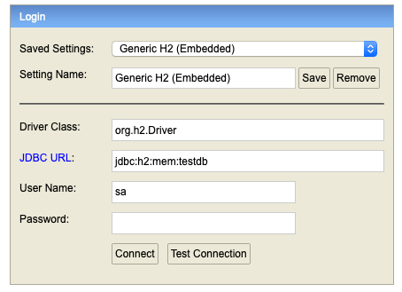

# Patient Similarity Application

CSE6242 cBioPortal Patient Similarity Prototype by Team 15

## Set up

### Prerequisites
* [Java 8](https://www.java.com/en/download/help/download_options.xml)
* [Maven](https://maven.apache.org/install.html)
* IDE like [Eclipse](https://www.eclipse.org/downloads) or [IntellJ Community](https://www.jetbrains.com/idea/download)
 
### Build and Run Application

You have can build and run the application through the command line or your IDE.

Before build, please run below to install the 3rd party jars.
```
mvn install:install-file -Dfile=<path-to-cbioportal-folder>/dependency/javaml-0.1.7.jar -DgroupId=net.sourceforge \
       -DartifactId=javaml -Dversion=0.1.7 -Dpackaging=jar
```
```
mvn install:install-file -Dfile=<path-to-cbioportal-folder>/dependency/ajt-2.9.jar -DgroupId=be.abeel \
       -DartifactId=javaml -Dversion=2.9 -Dpackaging=jar
```

**1. via Command line**  
In cbioportal/ directory run below commands.  
If you're using Mac or Linux in cbioportal/ directory run  
```
./mvnw clean install -DskipTests && java -jar target/cbioportal-0.0.1-SNAPSHOT.jar
```
If you're using Windows, use the cmd maven wrapper.
```
./mvnw.cmd clean install -DskipTests && java -jar target/cbioportal-0.0.1-SNAPSHOT.jar
```
*Note: If you have mvn in your $PATH, you can directly use mvn instead of the wrapper (mvnw).
You will need to add java to your $PATH, if not already added.*



**2. via IDE (Intellij)**

 - Build the project with maven 1) clean then 2) install.
 - Once the build is successful, run the application by right clicking CbioportalApplication.java -> Run




## Application

Once your application is running, go to http://localhost:8080/   
You will see something like the screenshot below. Clicking on say hello, makes an api call and populates the div above with "hello world".



## H2 Database

For this Proof of Concept, we use an in-memory H2 Database that is brought up when the application starts. To access this database, go to http://localhost:8080/h2-console
and connect with the default settings.



## Data preprocessing

Change directory to `src/main/resources/scripts` folder.
To run data preprocessing scripts, first install required python libraries by running:
```
pip install -r requirements.txt
```

Then run the script, that will output a file in `data/` folder.
Please check parameter details with `python data_preprocessing.py -h`
```
python data_preprocessing.py
```

## Experiment graphs

Change directory to `src/main/resources/scripts` folder.
To generate expeirment graphs, first install required python libraries by running:
```
pip install -r requirements.txt
```

Then run the script, that will save a png file in the current folder.
An example command is as below. Please check the python file for more options.
```
python experiment_graphs.py knn
```

